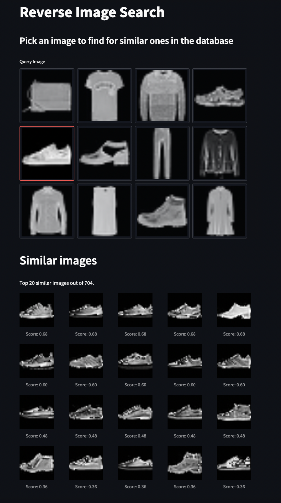

This is a tutorial for using Triton to deploy deep learning models and support a reverse image search application. 

## Reverse image search

In reverse image search, an image is used as a query to find similar images. Ths is different from typical image search where a text query like "cat photos" is used.

Two major inference modules are needed to support reverse image search:
- a image encoder module, which extract a feature vector from each image, and
- a vector similarity module, which returns the most similar images based on vector similarity.

Im this tutorial, we will be using the FashionMNIST dataset and show how to build a sample application like the screenshot below.



To run this example (Docker needed), please checkout the repo:

```shell
git clone https://github.com/kungfuai/triton-inference-examples
cd triton-inference-examples
```

### First, build the image search models

```shell
reverse_image_search/bin/build_models.sh
```

Once finished, you should expect to see a directory `model_repo` that has the following structure:

```
model_repo/
    image_encoder/
        config.pbtxt
        1/
            model.pt
    vector_similarity/
        config.pbtxt
        1/
            model.pt
```

Both of the `image_encoder` and `vector_similarity` modules are Pytorch models. There are other ways to implement the vector similarity module, such as using an approximate nearest neighbor search engine.

### Then, start the Triton inference server

If you have GPU and CUDA available:

```shell
reverse_image_search/bin/start_inference_server_gpu.sh
```

If you want to use CPU only:

```shell
reverse_image_search/bin/start_inference_server_cpu.sh
```

The above steps will use docker images and pulling down the docker image can take some time. If successful, you should expect to see something like this:

```
+-------------------+---------+--------+
| Model             | Version | Status |
+-------------------+---------+--------+
| image_encoder     | 1       | READY  |
| vector_similarity | 1       | READY  |
+-------------------+---------+--------+

I1112 04:49:54.394115 1 metrics.cc:757] Collecting CPU metrics
I1112 04:49:54.394311 1 tritonserver.cc:2264] 
+----------------------------------+--------------------------------------------------------------------------+
| Option                           | Value                                                                    |
+----------------------------------+--------------------------------------------------------------------------+
| server_id                        | triton                                                                   |
| server_version                   | 2.27.0                                                                   |
| server_extensions                | classification sequence model_repository model_repository(unload_depende |
|                                  | nts) schedule_policy model_configuration system_shared_memory cuda_share |
|                                  | d_memory binary_tensor_data statistics trace logging                     |
| model_repository_path[0]         | /models                                                                  |
| model_control_mode               | MODE_NONE                                                                |
| strict_model_config              | 0                                                                        |
| rate_limit                       | OFF                                                                      |
| pinned_memory_pool_byte_size     | 268435456                                                                |
| response_cache_byte_size         | 0                                                                        |
| min_supported_compute_capability | 6.0                                                                      |
| strict_readiness                 | 1                                                                        |
| exit_timeout                     | 30                                                                       |
+----------------------------------+--------------------------------------------------------------------------+

I1112 04:49:54.399529 1 grpc_server.cc:4819] Started GRPCInferenceService at 0.0.0.0:8001
I1112 04:49:54.400032 1 http_server.cc:3474] Started HTTPService at 0.0.0.0:8000
I1112 04:49:54.448312 1 http_server.cc:181] Started Metrics Service at 0.0.0.0:8002
```


### Finally, start a UI to visualize the results

Start the streamlit app:

```shell
reverse_image_search/bin/start_app.sh
```

Then visit http://localhost:8501/ in your browser.

